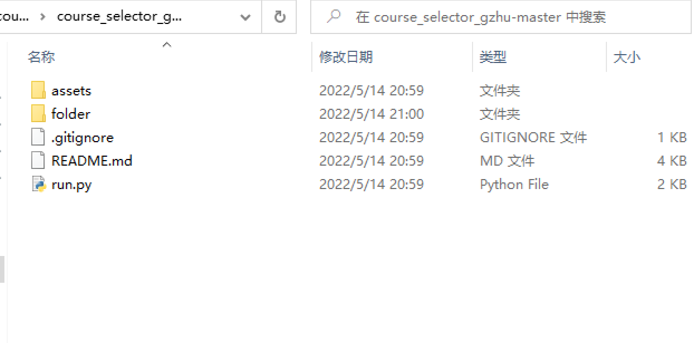

# 广州大学gzhu抢课脚本

> 适用于广大新版教务系统
>
> 谨献给745宿舍全体靓仔，祝各位靓仔学业顺利

## 功能

- 自动准备data表单，免去手动抓包的繁琐步骤
- 支持提前登录并能够自动保持登录状态，避免因登录太晚，登录人数太多导致无法登录的情况
- 支持同时抢多门课程
- 使用异步协程加快抢课速度

## 运行方法(必须先安装Edge浏览器)

### 方法一、运行exe文件（仅适用于WINDOWS）

- [下载](https://github.com/LihaoLikeOrangeJuice/course_selector_gzhu/releases)最新版本的course_selector_gzhu.exe文件
- [使用教程](#使用教程)

### 方法二、运行python源代码

#### python版本

python 3.9

#### 安装依赖

```shell
pip3 install requests
pip3 install selenium
pip3 install aiohttp
pip3 install webdriver-manager
```

## 使用教程

### 1. 浏览器登录选课系统，复制所有自己想选课程的名称并记住这些课程的类别



如上图，不要把两边的空格复制进去！从"("开始复制，到"学分"的"分"字结束。

把所有的课程名称先保存在本地，运行程序时将会用到。

脚本运行时如果使用浏览器登录教务系统，脚本的登录状态将会失效。

### 2. 运行程序(建议连接校园网)，根据提示操作

### 3. 在选课系统试运行时（一般在选课开始前几天），运行一次程序以录入抢课信息

抢课信息录入完毕后，程序会提示“data表单准备完成,抢课信息录入完毕。”

### 4. 在正式选课开始前20到30分钟时运行程序进行抢课

运行太晚可能会登录不上。
