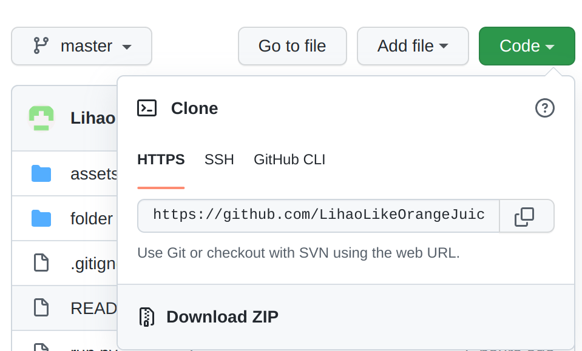
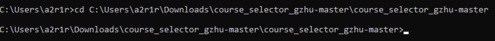
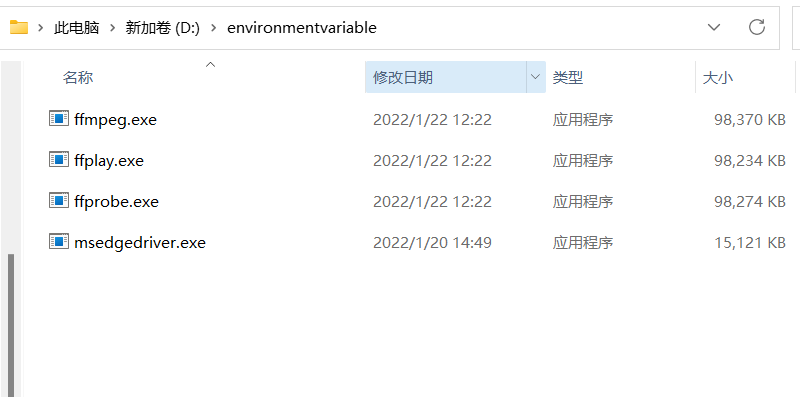
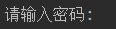
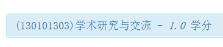

# 广州大学gzhu抢课脚本

必须安装了Edge浏览器才能运行

> 适用于广大新版教务系统 <https://newcas.gzhu.edu.cn/cas/login?service=https%3A%2F%2Fnewmy.gzhu.edu.cn%2Fup%2F>
>
> 谨献给745宿舍全体靓仔，祝各位靓仔学业顺利
>
> 本人不对因使用此脚本而产生的任何后果或损失负责
>
> 如果遇到bug请重新运行程序

<!-- @import "[TOC]" {cmd="toc" depthFrom=1 depthTo=6 orderedList=false} -->

<!-- code_chunk_output -->

- [广州大学gzhu抢课脚本](#广州大学gzhu抢课脚本)
  - [运行方法](#运行方法)
    - [1.运行exe文件（仅适用于WINDOWS）](#1运行exe文件仅适用于windows)
    - [2.运行python源代码](#2运行python源代码)
      - [python版本](#python版本)
      - [需要安装的库](#需要安装的库)
      - [WINDOWS下简单的环境配置教程](#windows下简单的环境配置教程)
  - [使用教程](#使用教程)
    - [1. 在自己的浏览器登录教务系统选课界面，找到所有自己想选的课程，并完整复制其名称](#1-在自己的浏览器登录教务系统选课界面找到所有自己想选的课程并完整复制其名称)
    - [2. 运行程序，建议在校园网环境下运行](#2-运行程序建议在校园网环境下运行)
    - [3. 根据提示输入学号和密码](#3-根据提示输入学号和密码)
    - [4. 等待一段时间后，根据提示操作](#4-等待一段时间后根据提示操作)
    - [5. 请在选课系统试运行时（一般在选课开始前几天）运行一次脚本](#5-请在选课系统试运行时一般在选课开始前几天运行一次脚本)
    - [6. 请在正式选课开始前运行20到30分钟时运行程序](#6-请在正式选课开始前运行20到30分钟时运行程序)
    - [7. 请不要随意删除程序文件夹内的文件](#7-请不要随意删除程序文件夹内的文件)

<!-- /code_chunk_output -->

## 运行方法

### 1.运行exe文件（仅适用于WINDOWS）

链接<https://github.com/LihaoLikeOrangeJuice/course_selector_gzhu/releases>，请下载最新版本的course_selector_gzhu.exe文件

### 2.运行python源代码

#### python版本

python 3.9

#### 需要安装的库

1. requests
2. selenium(4.0.0及以上)
3. aiohttp
4. webdriver_manager

安装代码:

```shell
pip3 install requests
pip3 install selenium
pip3 install aiohttp
pip3 install webdriver-manager
```

#### WINDOWS下简单的环境配置教程

- 下载并安装python，在<https://www.python.org/downloads/windows/>网站下载python3.9对应的Windows installer并安装
- 安装完成后，打开cmd，依次执行[需要安装的库](#需要安装的库)部分所列出的代码
- 然后下载此项目的zip文件，如下图，先点code按钮，再点Download ZIP下载zip文件



- 下载完成后解压，然后进入文件夹，进入到run.py同级目录后（如下图），复制地址


之后打开cmd，输入`cd`，输入空格，然后粘贴刚刚复制的地址，回车，如下图



最后输入`python run.py`，再回车，即可运行程序，如下图



之后的教程请参考下方

## 使用教程

### 1. 在自己的浏览器登录教务系统选课界面，找到所有自己想选的课程，并完整复制其名称

如图所示，示例:(130101303)学术研究与交流 - 1.0 学分


注意！不要把两边的空格复制进去！从"("开始复制，到"学分"的"分"字结束。

可以把课程名称先保存在txt文件中，方便后面运行程序时复制粘贴。

因为运行脚本时如果使用浏览器登录自己的教务系统账号，脚本的登录状态将会失效。

同时需要记住该门课程的类别：是主修课程，板块课体育，通识选修还是其他特殊课程？需要记住。

### 2. 运行程序，建议在校园网环境下运行

### 3. 根据提示输入学号和密码




### 4. 等待一段时间后，根据提示操作

### 5. 请在选课系统试运行时（一般在选课开始前几天）运行一次脚本

运行一次脚本录入信息,以方便在抢课开始时迅速开始抢课

出现'data表单准备完成,抢课信息录入完毕。'信息即可

### 6. 请在正式选课开始前运行20到30分钟时运行程序

要是运行太晚可能会出现登录不上的情况。

更早运行虽然没有必要，但是是没有问题的，另一个进程会一直维持登陆状态

### 7. 请不要随意删除程序文件夹内的文件
